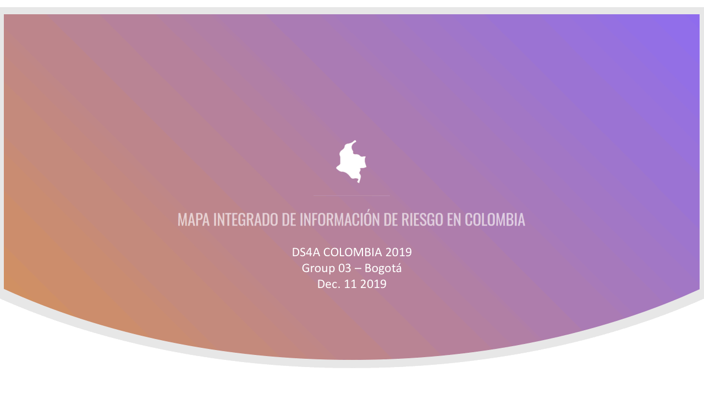
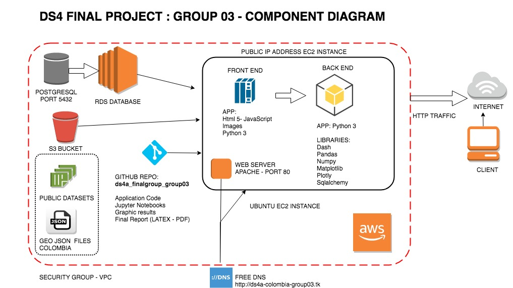
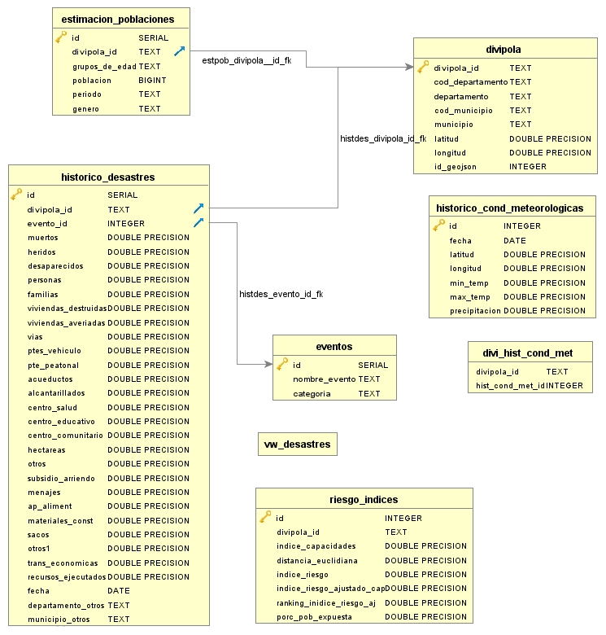

#  Integrated Risk Information Map - Final Project 
#  Datascience for All (DS4A) - Team 03: 

Datascience for All (DS4A) - Integrated Risk Information Map - Final Project - Group 3: December 2019

Integrated Risk Information Map - Mapa Integrado Información de Riesgo

Mario Cerón, Johnathan Salamanca, Carol Martinez, Javier Cocunubo, Jairo Niño, Alvaro Muñoz

#Repositories: 

https://github.com/marioceron/DS4A_Integrated_Risk_Information_Map_Final_Project_Team03_2019

https://github.com/jssalamanca1967/ds4a_finalgroup_group03/

# Introduction: 

# Folders:

# /aws_diagrams: 
* AWS deployment and component diagram, ER Model and flow chart of Python Dash app

# /code
* /dash: Relevante code of the Python Dash app (app.py)

* /html: Static content (welcome page)

# /datasets: 
* CSV files with datasets: divipola, lattitude_longuitud,demographics, temperatures and precipitation
* Database: 7 tables: divipola, eventos, riesgo_indices, historico_desastres, estimacion_poblaciones, historico_cond_meteorologicas, divi_hist_cond_met; and one view: vw_desastres

# /latexDocuments: 
* /project: Reports and images in Latex format and PDF format: Report_project_final.pdf 

# /presentation: 
* pptx presentation, movie and animated gif.

# Presentation :

Animated Gif with the presentation:

# AWS Component Diagram:

# Entity Relationsip (ER) Model - Integrated Risk Information Map:

# Jupyter Notebook with Results in PDF:

# Final Report:

https://github.com/marioceron/DS4A_Integrated_Risk_Information_Map_Final_Project_Team03_2019/blob/9186c94952e4d93369de00f5b391a45f95d85d05/latexDocuments/project/Report_project_final.pdf
